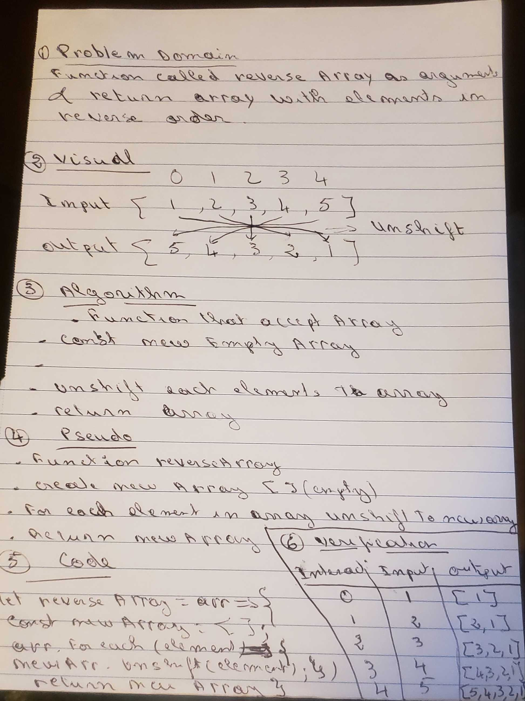

# data-structures-and-algorithms

# Reverse an Array

## Challenge

Write a function called reverseArray which takes an array as an argument. Without utilizing any of the built-in methods available to your language, return an array with elements in reversed order.

## Approach & Efficiency

unshift methode helps push element to array from the front, I think it will be good and easy fo me to use that methode with a given array  and I can unshift to revearse them. It might be another methode that will help to push the reverse number into a new array. 

## Solution

# Shift Array

## Challenge

Write a function called insertShiftArray which takes in an array and the value to be added. Without utilizing any of the built-in methods available to your language, return an array with the new value added at the middle index.

## Approach & Efficiency

- create an empty array to add elements to as I believed it would be more difficult to modify the input array.
- created an independan counter for the new array as they will have different lengths eventually. 
- iterate through the input array and insert each element into the new array with each iteration. 
- returned the new array.

## Solution

# Binary Array

## Challenge

Write a function called BinarySearch which takes in 2 parameters: a sorted array and the search key. Without utilizing any of the built-in methods available to your language, return the index of the array’s element that is equal to the search key, or -1 if the element does not exist.

## Approach & Efficiency

I decided first to create an empty array to add elements to as I believed it would be more difficult to modify the input array. I created an independan counter for the new array as they will have different lengths eventually. I then chose to iterate through the input array and insert each element into the new array with each iteration. Once the iteration reached halfway through the input array rounding up minus 1 I set the new arrays value to equal the input value then continued with the loop. I returned the new array.

## Solution

# Shift Array

## Challenge

Write a function called insertShiftArray which takes in an array and the value to be added. Without utilizing any of the built-in methods available to your language, return an array with the new value added at the middle index.

## Approach & Efficiency

- create an empty array to add elements to as I believed it would be more difficult to modify the input array.
- created an independan counter for the new array as they will have different lengths eventually. 
- iterate through the input array and insert each element into the new array with each iteration. 
- returned the new array.

# multiBrackectValidation

## Challenge

Your function should take a string as its only argument, and should return a boolean representing whether or not the brackets in the string are balanced. There are 3 types of brackets:

Round Brackets : ()
Square Brackets : []
Curly Brackets : {} 

## Approach & Efficiency

- class Node
The val stored in the Node next - A pointer the next Node in the list

- Stack Class properties
  - push()

  which takes any value as an argument and adds a new node with that value to the top of the stack. big O: o(1)

  - pop()

  Removes the node from the top of the stack, and returns the node’s value.
    

  - Validator function

  If the brackets are open or closed, open will push to the stack and closed bracket will pop from the stack. If matches it will return booloen.

## Solution

