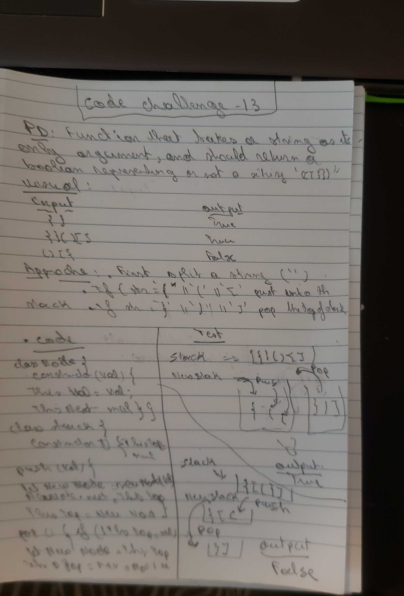

# code challenge 13

### Author: Blandine Dasilveira

# multiBrackectValidation

[submission PR](https://github.com/Blandine12/data-structures-and-algorithms/pull/30)

## Challenge

Your function should take a string as its only argument, and should return a boolean representing whether or not the brackets in the string are balanced. There are 3 types of brackets:

Round Brackets : ()
Square Brackets : []
Curly Brackets : {} 

## Approach & Efficiency

- class Node
The val stored in the Node next - A pointer the next Node in the list

- Stack Class properties
  - push()

  which takes any value as an argument and adds a new node with that value to the top of the stack. big O: o(1)

  - pop()

  Removes the node from the top of the stack, and returns the node’s value.
    

  - Validator function

  If the brackets are open or closed, open will push to the stack and closed bracket will pop from the stack. If matches it will return booloen.

## Solution

